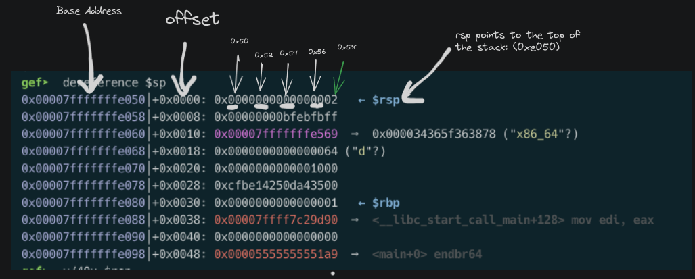

# GEF Summary

## Security Check
```
checksec
```

## Reading elf structure
```
elf
```

## Getting registers info

```
registers
```

## Comprehensive address space layout

`vmmap` displays the target process's entire memory space mapping.gv

```
vmmap
vmmap stack // print stack layout
```

## Breakpoints
```
info breakpoints

```

### Show the hexdump of stack. 

```
hexdump byte $rsp
hexdump byte $rbp
```

rbp-0x4
rbp-0x8
rbp-0x110


```
 run <<< $(python3 -c "import sys; sys.stdout.buffer.write(b'aaaaaaaaaaaaaaaaaaaaaaaaaaaaaaaaaaaaaaaaaaaaaaaaaaaaaaaaaaaaaaaaaaaaaaaaaaaaaaaaaaaaaaaaaaaaaaaaaaaaaaaaaaaaaaaaaaaaaaaaaaaaaaaaaaaaaaaaaaaaaaaaaaaaaaaaaaaaaaaaaaaaaaaaaaaaaaaaaaaaaaaaaaaaaaaaaaaaaaaaaaaaaaaaaaaaaaaaaaaaaaaaaaaaaaaaaaaaaaaaaaaaaaaaaaaaaaaaaaaaaaaaaaaA' + b'\xca\xfe')")
```


## Layout explained


```
address: 0x(4 bytes) 0x(4 bytes) 0x(4 bytes) 0x(4 bytes) => total 16 bytes
address+10: ...
```



### Stack Frame Structure

A stack frame typically contains:

1. **Local Variables**: Variables declared inside a function.
2. **Saved Registers**: Registers that need to be preserved across function calls (like the base pointer `$rbp`).
3. **Function Arguments**: Passed to the function.
4. **Return Address**: Address to return to after the function call completes.
5. **Padding and Alignment**: Ensures proper alignment for performance and architectural requirements.

### using xxd in gdb

```

(gdb) define xxd
>dump binary memory dump.bin $arg0 $arg0+$arg1
>shell xxd dump.bin
>end
(gdb) xxd &j 10 
0000000: 0000 0000 0000 0000 0000 0000 4d8c a7f7  ............M...
0000010: ff7f 0000 0000 0000 0000 0000 c8d7 ffff  ................
0000020: ff7f 0000 0000 0000
(gdb) xxd $rsp 100  // print 100 bytes ahead of top of the stack
```


### What is there in between start and offset address in vmmap command?

**Headers or Metadata**: Depending on the format of the file and the loader, there might be headers, metadata, or other information associated with the file. These might not directly correspond to memory segments but could be present between the "Start" address and the "Offset" within the file.

### Inspecting the code segment with xxd command


> I though those static strings would be loaded from somewhere else in memory.. 🤔 

### Getting heap chunks

```
heap-chunks -a
```

### Getting the information about current stack frame

```
info frame
info args
info locals
```

